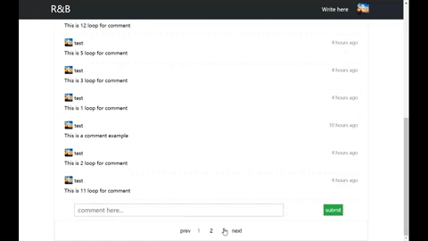

# koaPrac
This is a blog system backend by koa and mongodb.
This repo is blog system server part and you can find client part at [reactblog](https://github.com/cpprookie/reactblog). The client part is created by 
**react react-router react-redux axios** etc. Looks really terrible poject structure right? It does, i'm trying to make it looks better~~

## run this project
---
- You need to have mongodb running on your pc and port is `27017`. you can change port by edit `config/index.js`
- `npm install` 
- `npm start`
- open your browser at `localhost:3001`. 

Welcome for pull request and issues, have fun :)
